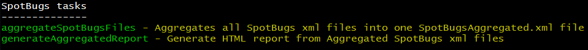
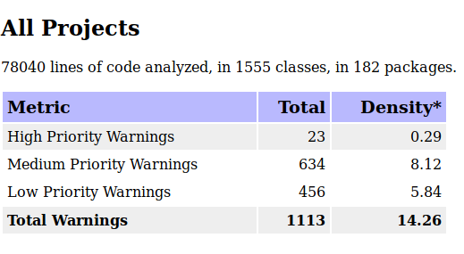

== Report Aggregator

Running a build with SpotBugs is nice, but the only thing you get is a bunch of XML files in the build folder.
You can use many different xslt scripts to transform these XML files to HTML, but then you just have plenty of different html reports for each and every project, which has been checked by SpotBugs...

This Gradle plug-in tries to aggregate this information in one single XML file and then generates an aggregated HTML report for all projects

== Using this Gradle plug-in

This Gradle plug-in can be found here: https://plugins.gradle.org/plugin/com.simonscholz.reports

[source, groovy]
----
plugins {
  id "com.simonscholz.reports" version "0.0.1"
}
----

Adding this Gradle plug-in adds two new tasks to your build file:

* aggregateSpotBugsFiles - just generates a SpotBugsMerged.xml of all _spotbugsXml.xml_ files in build directories of the project (target for Maven, build for Gradle)
* generateAggregatedReport - Generates a _SpotBugsMerged.xml_ file, if not already present, and uses it to create a _SpotBugsMerged.html_ HTML report.

== Viewing the results

The results will be available in the SpotBugsMerged.xml and SpotBugsMerged.html files:

